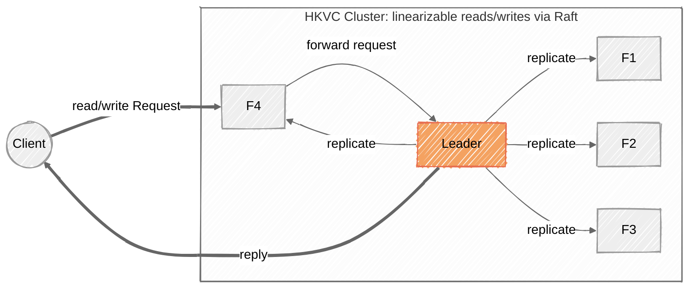

# HKVC: A Multi-Raft KV Store with Hierarchical Namespace

HKVC is a hierarchical, linearizable key-value store built bottom-up from three independent Go modules. Each layer depends only on the layer below it, wired together with `replace` directives in the per-module `go.mod` files.

## Architecture



## remote: the RPC layer

`remote` turns a struct of function fields (a "service interface") into a network-backed client stub, and hosts the matching object on a server ("callee"). It uses reflection to marshal arguments and return values with `gob`, and every service method must end in `remote.RemoteError` so that transport failures are distinguishable from application errors.

Connections are wrapped in a `LeakySocket` that can inject packet loss and delay. The caller's send/receive loop retries transparently until it decodes a reply, so higher layers get an at-least-once RPC that eventually succeeds while the callee is reachable. This is the knob the raft tests use to simulate flaky networks.

Key types: `NewCalleeStub` / `CalleeStub` (server), `CallerStubCreator` (client), `LeakySocket`, `RemoteError`.

## raft: the consensus layer

`raft` implements leader election and log replication over `remote`. Each peer runs two RPC surfaces:

- **RaftInterface** (`RequestVote`, `AppendEntries`) for peer-to-peer traffic. Its callee is toggled by `Activate`/`Deactivate` to simulate failure.
- **ControlInterface** (`Activate`, `Deactivate`, `Terminate`, `GetStatus`, `NewCommand`, `GetCommittedCmd`) for a controller/client.

A background loop drives the state machine: a leader sends heartbeats every `HeartbeatInterval` and advances `commitIndex` to the median `matchIndex` of the current term; a follower or candidate starts an election after a randomized timeout in `[ElectionTimeoutMin, ElectionTimeoutMax)`. The log is 1-indexed (index 0 is a dummy sentinel), and only entries at or below `commitIndex` are returned as committed.

There are two constructors: `NewRaftPeer` (standalone controller model, runs a ControlInterface and blocks until terminated) and `NewHKVCRaftPeer` (embedded in HKVC, no ControlInterface, returns the peer for in-process use via `SubmitCommand` / `WaitForCommit` / `GetLogEntry`).

No persistence, log compaction, or membership changes: the failure model is process pause/resume, not crash-recovery from disk.

## hkvc: the store

An HKVC cluster is a set of **participants**. Each participant runs:

- an HTTP client interface (the six endpoints below),
- a control-plane RPC callee (`HKVCControlInterface`), and
- one raft peer per **group** it belongs to.

Group 0 always contains every participant and manages the root directory `/`. Additional groups shard subtrees so different directories can be served by different leaders in parallel.

### Namespace and sharding

State is a tree of directories, each holding key-value pairs and child directories. Every directory is owned by exactly one raft group:

- the root is owned by group 0;
- a directory created directly under the root is assigned a group by round-robin over the sorted group IDs (spreading load);
- a directory created deeper inherits its parent's group, so one leader can resolve an entire path it owns.

Only the leader of the owning group serves requests for a directory; other participants answer `HKVCNonRaftLeaderError`, which lets a client locate the right leader (for example via `/get_metadata`, which any holder may serve).

### Request lifecycle (e.g. `POST /set`)

```
validate path/key         -> 400 HKVCInvalidRequestError on bad input
check leadership          -> 403 HKVCNonRaftLeaderError if not our group's leader
check client sequence     -> replay cached reply (duplicate) or 406 (outdated)
submit command to raft    -> block until committed on a majority
apply committed entries   -> mutate the in-memory tree in strict log order
respond and cache reply    -> so a client retry replays the same result
```

Reads (`/list`, `/get`) submit a **no-op through raft** before answering. This is what makes reads linearizable: the response reflects everything committed up to the moment the leader reconfirmed its leadership, so a stale ex-leader cannot serve an old value.

### Consistency and deduplication

Each client stamps requests with a monotonically increasing sequence number. A request equal to the last seen number replays the cached response (safe client retry); a smaller number is rejected with `HKVCMsgOutOfSequenceError`. Because commands are applied strictly in raft log order on every participant, all replicas converge on the same tree.

### HTTP endpoints

|    Endpoint     | Purpose                                                 |
| :-------------: | ------------------------------------------------------- |
|     `/list`     | names of a directory's children                         |
|     `/get`      | value for a key                                         |
| `/get_metadata` | size/version/owning-group/leader for a key or directory |
|     `/set`      | create or overwrite a key (version bumps on overwrite)  |
|    `/create`    | create a subdirectory                                   |
|    `/delete`    | remove a key or a subdirectory and its contents         |

## Testing strategy

Each package is tested at two levels:

- **Unit tests** exercise the pure logic in isolation, with no network: reflection validation and `LeakySocket` in `remote`; the election-restriction and log-consistency rules in `raft`; path normalization, sequencing, and the apply handlers in `hkvc`; the booking rules in `ticketbox`. These run in seconds and pin behavior down deterministically.
- **Integration tests** stand up real clusters over TCP/HTTP and drive them through failures. Addresses are drawn from the kernel (`:0`) rather than guessed, which removes port-collision flakiness.

A **linearizability** integration test (`hkvc/linearizability_test.go`) checks recorded client histories with [porcupine](https://github.com/anishathalye/porcupine). It stands up a real cluster, drives concurrent get/put clients (with and without leadership churn), and asserts the combined history is linearizable against a per-key register model.
