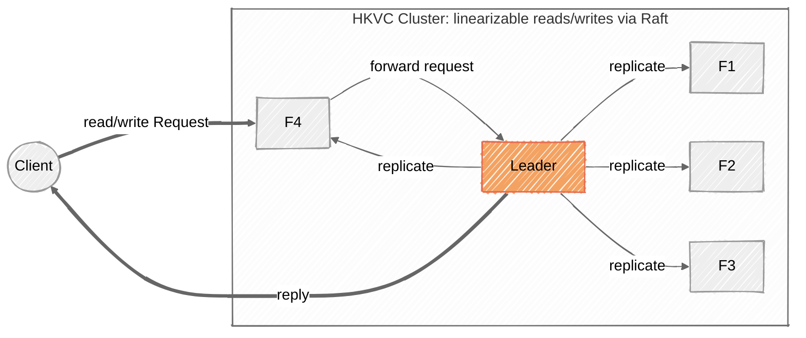

# HKVC: A Multi-Raft KV Store with Hierarchical Namespace

A **H**ierarchical **K**ey-**V**alue storage **C**luster written in Go from scratch, organized across three self-contained modules.

Each module has its own README with API documentation and usage examples. See [`remote/`](remote/README.md), [`raft/`](raft/README.md), and [`ticketbox/`](ticketbox/README.md).

## Architecture

